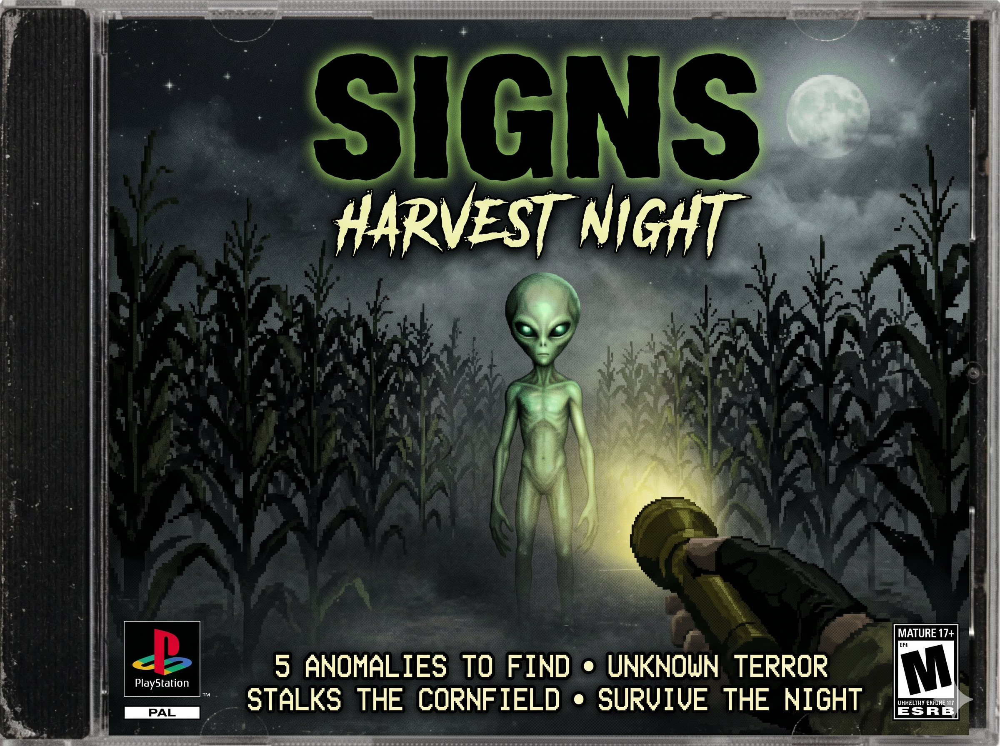

# Signs: Harvest Night 👾


**A 3D horror FPS prototype** — explore a dark cornfield at night, collect 5 anomalies, and avoid a classic Grey alien stalker. Built with Three.js in PSX retro style.

> 🕹️ **Play now:** Open `index.html` in your browser (served via HTTP, see below)

---

## 🎮 Features

- **First-person exploration** — WASD movement + mouse look (PointerLockControls)
- **Flashlight** — Narrow SpotLight cone attached to the camera, your only light source
- **Anomaly collection** — Find 5 glowing anomalies hidden in the cornfield
- **Alien stalker** — A classic Grey alien (green variant) that chases you through the corn
  - Contact kill: alien touches you → game over
  - Stare mechanic: looking at the alien for too long → game over
- **UFO abduction cinematic** — When you die, a UFO descends and abducts you (~2.3s sequence)
- **Audio system** — Night ambience, footsteps, TV static on stare, cow moo easter egg
- **PSX retro mode** (branch `psx`) — 640×480 resolution, flat shading, pixelated rendering, dithering

## 🎯 Objective

Find all **5 anomalies** hidden in the cornfield before the stalker gets you.

| Anomaly | Shape | Color |
|---|---|---|
| Orb of Whispers | Sphere | Blue |
| Verdant Knot | Torus Knot | Green |
| Violet Shard | Icosahedron | Violet |
| Amber Spire | Cone | Amber |
| Crimson Polyhedron | Dodecahedron | Red |

## 🕹️ Controls

| Key | Action |
|---|---|
| **Click** | Lock pointer / Start game |
| **W A S D** | Move |
| **Mouse** | Look around |
| **R** | Restart (on Game Over / Win) |
| **Click on cow** | Make it moo! 🐄 |

## 🚀 How to run

```bash
# Clone
git clone https://github.com/teixeirazeus/signs-harvest-night.git
cd signs-harvest-night

# Serve (any HTTP server works)
python3 -m http.server 8765

# Open in browser
open http://localhost:8765
```

> ⚠️ **Must use an HTTP server** — ES modules (Three.js importmap) require CORS headers that `file://` URLs don't provide.

## 🌿 Branches

| Branch | Description |
|---|---|
| `main` | Original greybox prototype — standard Three.js rendering |
| `psx` | **Active development** — PSX retro style (640×480, flat shading, scanlines, dithering) |

## 🛠️ Tech Stack

- **[Three.js](https://threejs.org/) r160** — 3D rendering
- **[Howler.js](https://howlerjs.com/) v2.2.4** — Game audio
- **Vanilla JS (ES modules)** — No build tools, no bundlers
- **PSX-style rendering** — Self-imposed constraints (low resolution, flat shading, no AA)

## 🔊 Sound assets

All sounds are CC0 / royalty-free, sourced from:
- [OrangeFreeSounds](https://orangefreesounds.com/) — Night ambience
- [OpenGameArt](https://opengameart.org/) — Footsteps, TV static
- [Wikimedia Commons](https://commons.wikimedia.org/) — Cow moo (CC BY-SA 4.0)

## 📁 Project structure

```
signs-harvest-night/
├── index.html          # Entry point — Three.js importmap + Howler CDN
├── style.css           # Horror-themed UI (CRT scanlines, vignette, retro fonts)
├── main.js             # All game logic (~1800 lines, modular sections)
├── debug-alien.html    # Standalone alien model viewer (OrbitControls)
├── sounds/             # 31 audio files (ambience, footsteps, TV static, cow moo)
├── .gitignore
├── LICENSE             # MIT
└── README.md
```

## 📜 License

MIT — see [LICENSE](LICENSE).

---

*Made for the Hermes Agent — retro gaming meets AI-assisted development.*
